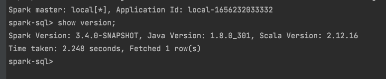
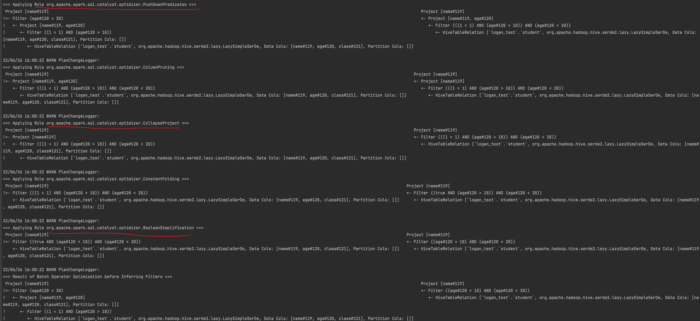
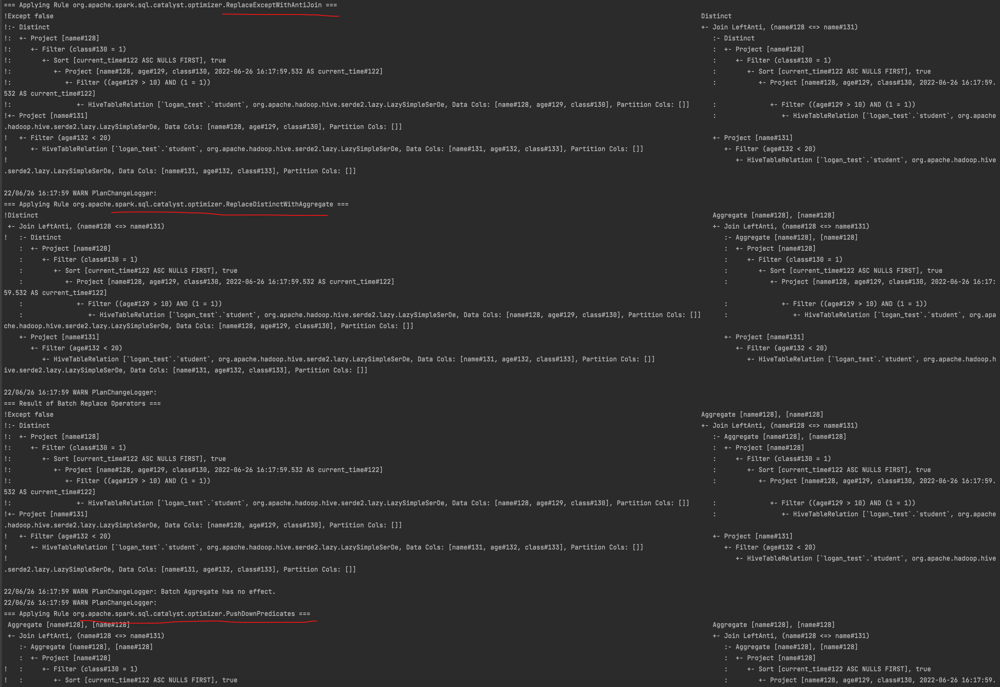
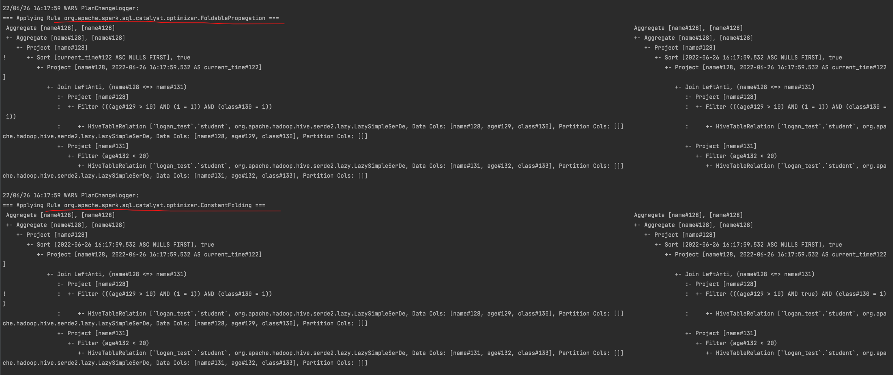
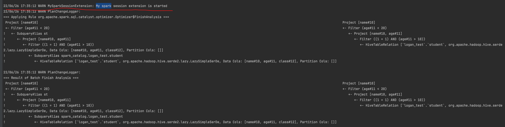

## 作业一： 为Spark SQL添加一条自定义命令
- SHOW VERSION;
- 显示当前 Spark 版本和 Java 版本。

### 思路 (代码在job1中)
- 下载Spark源码，git clone https://github.com/apache/spark.git
- 修改SqlBaseParser.g4, 添加SHOW VERSION statement
- 新建一个ShowVersionCommand scala类，实现获取Spark, Scala, Java version并返回Row
- 修改org.apache.spark.sql.execution.SparkSqlParser，覆写visitShowVersion方法并调用ShowVersionCommand方法
- 运行命令：build/mvn clean package -DskipTests -Phive -Phive-thriftserver打包Spark
- 在terminal运行./bin/spark-sql, 在shell命令中运行show version返回Spark, Scala, Java版本信息

### 执行结果

## 作业二：构建 SQL 满足如下要求
### 1. 构建一条 SQL，同时 apply 下面三条优化规则：
   - CombineFilters
   - CollapseProject
   - BooleanSimplification

#### 思路
- CombineFilters: 合并两个相邻的Filters,谓词下推的一种形式,把对同个表的Filter合并到一起,如10 < age < 20
- CollapseProject: 合并两个相邻的project,我理解和列剪枝一样,不需要的列不project
- BooleanSimplification: 布尔表达式简化,条件中的表达式满足true,则可以省略,如sql中1 = 1

#### 代码
``select name from (select name, age from student where 1 = 1 and age > 10) st where st.age < 20``

#### 执行结果

### 2. 构建一条 SQL，同时 apply 下面五条优化规则：
- ConstantFolding
- PushDownPredicates
- ReplaceDistinctWithAggregate
- ReplaceExceptWithAntiJoin
- FoldablePropagation

#### 思路
- ConstantFolding: 常量折叠,常量预计算或移除常量中的表达式,如示例中1 = 1
- PushDownPredicates: 谓词下推,Filter条件推到数据源,减少数据量,age > 10
- ReplaceDistinctWithAggregate: 将distinct去重转为group by聚合操作,如distinct
- ReplaceExceptWithAntiJoin:将Except差集转为Left-Anti Join左半连接,如except
- FoldablePropagation:可折叠传播, order by被computed value替代

#### 代码
``select distinct name from (select name, age, class, NOW() as current_time from student where age > 10 and 1=1 order by current_time) st where st.class=1 except select name from student where age < 20``

#### 执行结果

## 作业三：实现自定义优化规则（静默规则）
实现一个自定义的Extension.

### 代码在 src/main/scala/*

## 执行结果

